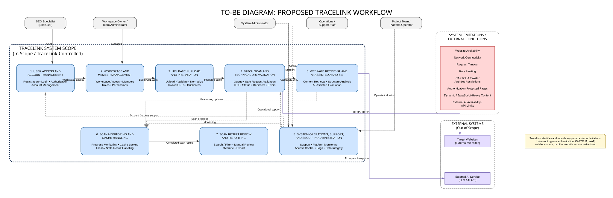
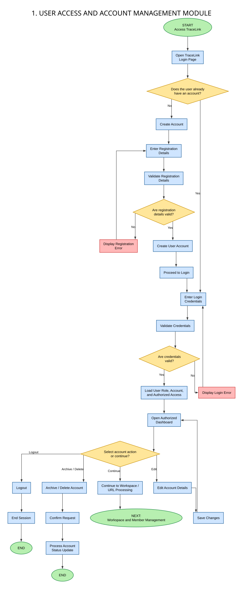
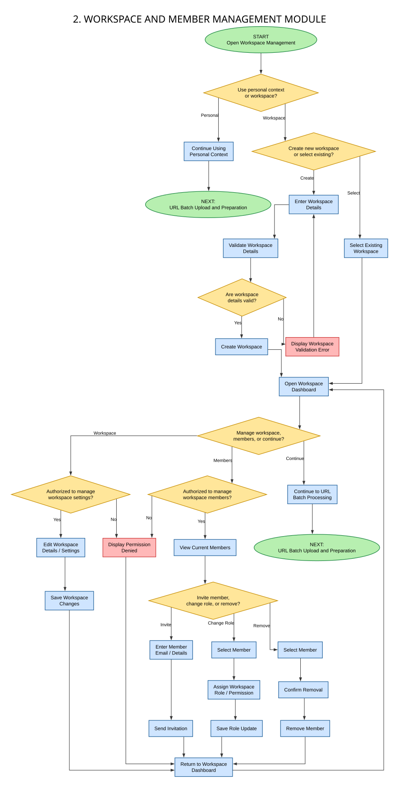
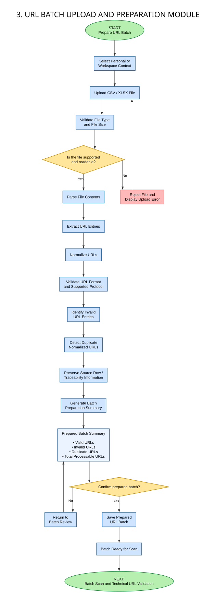
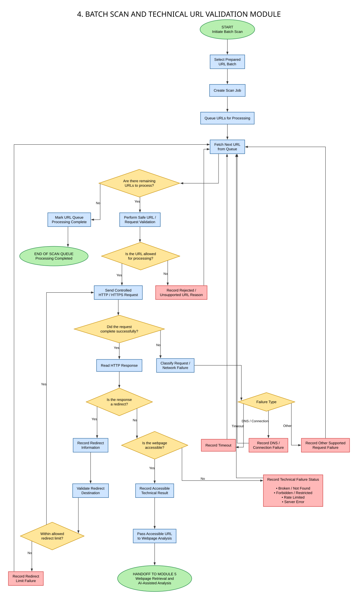
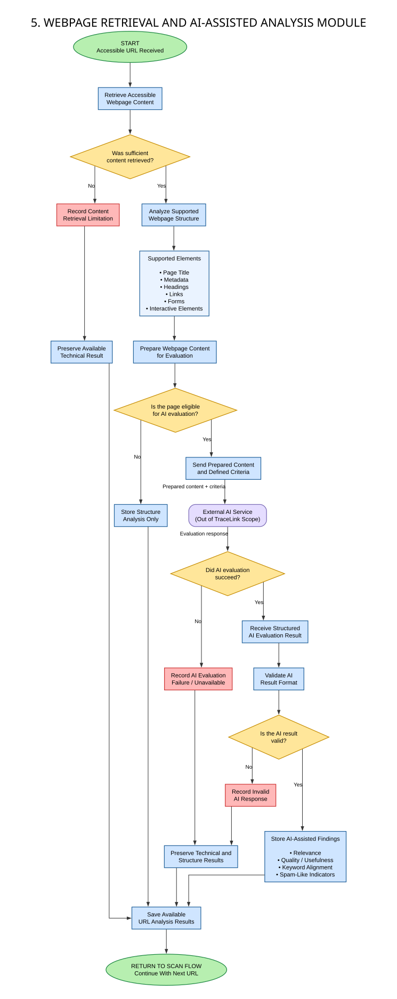
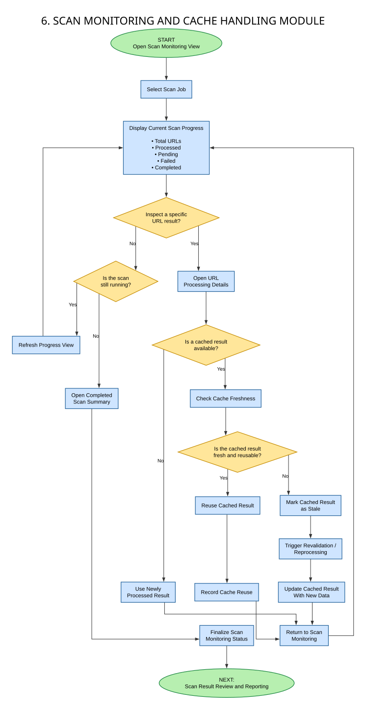
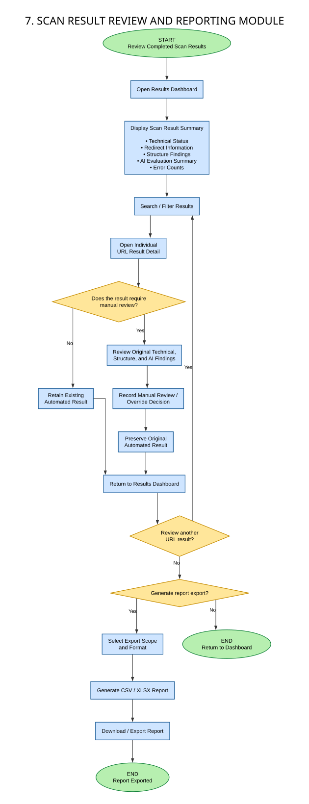
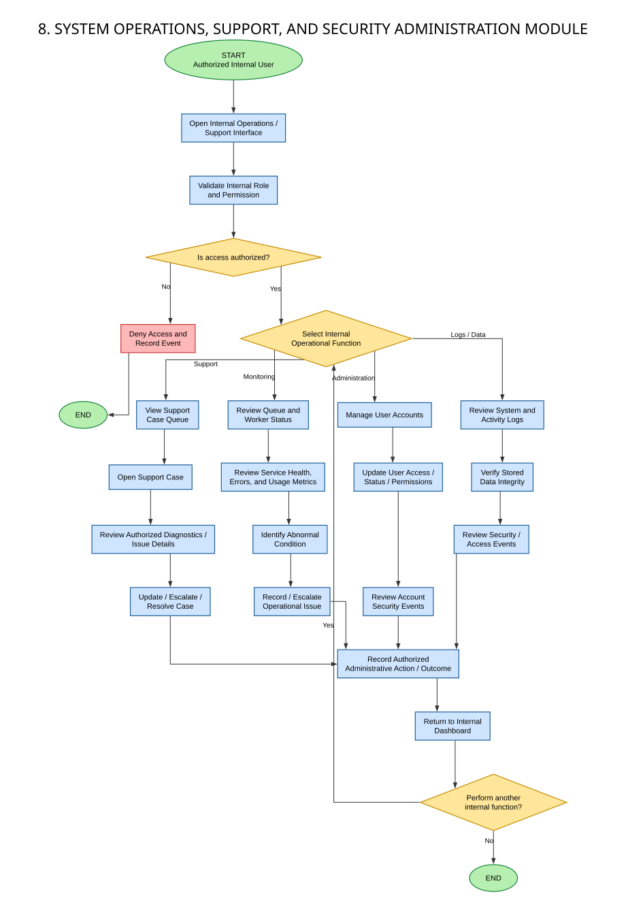

# TraceLink TO-BE Process Model

This directory contains the proposed TO-BE workflow for TraceLink.

The master diagram provides the high-level relationship between the eight process modules, system actors, external systems, system limitations, and the TraceLink system boundary.

---

## Master TO-BE Diagram

---

# Detailed Process Modules

## Module 1 — User Access and Account Management

---

## Module 2 — Workspace and Member Management

---

## Module 3 — URL Batch Upload and Preparation

---

## Module 4 — Batch Scan and Technical URL Validation

---

## Module 5 — Webpage Retrieval and AI-Assisted Analysis

---

## Module 6 — Scan Monitoring and Cache Handling

---

## Module 7 — Scan Result Review and Reporting

---

## Module 8 — System Operations, Support, and Security Administration

